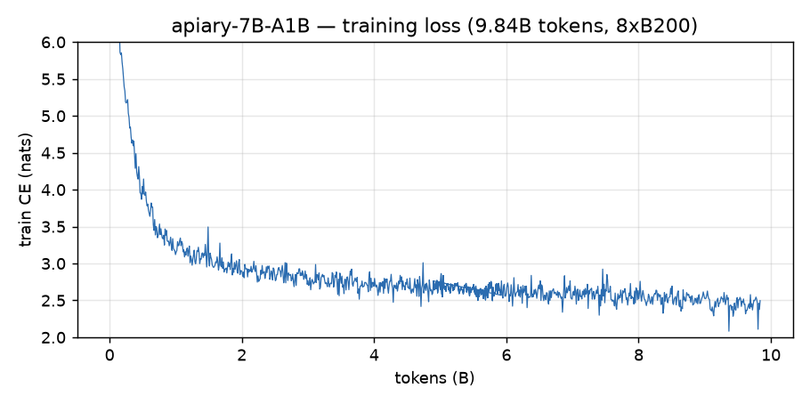

# apiary

A hive of 64 experts. From-scratch pretraining of a **6.85B-total / 1.21B-active fine-grained MoE** — the exact
Qwen3-MoE architecture (64 experts, top-8, 16 layers, d=2048, GQA 16/8 with QK-norm, 4k context, SmolLM2 49k
tokenizer) — on one Modal `B200:8` node in ~5 hours, in pure PyTorch: FSDP2 (`fully_shard`), `torch.compile`,
`torch.nn.functional.grouped_mm` experts, SDPA. No DeepSpeed, Megatron or torchtitan. ~800 lines.

| file | what |
|---|---|
| `configs.py` | model + training dataclasses, presets (`main`, `smoke`, `tiny`), shared argparse |
| `model.py` | Qwen3-MoE-compatible decoder; grouped-GEMM MoE with eager fallback; load-balance + z-loss; self-test |
| `data.py` | FineWeb-Edu parquet → uint16 shards (Modal CPU fan-out); deterministic, resumable memmap loader |
| `train.py` | torchrun entry: FSDP2 + compile, AdamW, wall-clock WSD schedule, async checkpoints, HF export |
| `export.py` | HF `Qwen3MoeForCausalLM` writer (per-expert keys: loads in transformers and vLLM) + logits-parity check |
| `modal_app.py` | Modal images/volumes/functions: `tokenize`, `smoke` (H200:2), `train` (B200:8), `evaluate` (H100) |

## Run
```bash
pip install modal && modal profile activate <profile>
modal run modal_app.py --stage tokenize --n-files 20                             # 15.3B tokens, ~12 min, ~$2
modal run modal_app.py --stage smoke --args "--preset smoke"                     # H200:2: compile, ckpt/resume, export
modal run --detach modal_app.py --stage train --args "--time-budget-min 320"     # the run; follow with `modal app logs`
modal run modal_app.py --stage evaluate --args "/ckpt/main/export"               # parity check + lm-eval
pytest tests/                                                                    # CPU tests on a tiny config
```

## Results

Final model: **9.84B tokens**, train CE **2.465** / held-out CE **2.462** (ppl 11.7),
**314 B200 node-minutes** (41.9 GPU-hours), median **612k tok/s / 28.3% MFU** on 8xB200.
Weights + card: [DruidTheGetafix/apiary-7B-A1B](https://huggingface.co/DruidTheGetafix/apiary-7B-A1B).

lm-eval-harness, 0-shot (acc_norm where the task defines it):

| HellaSwag | ARC-easy | ARC-challenge | PIQA | Winogrande | MMLU | wikitext word-ppl |
|---|---|---|---|---|---|---|
| 48.8 | 59.6 | 33.4 | 70.9 | 52.5 | 25.5 | 19.2 |

A coherent GPT-2-XL / Pythia-1B-class base model — competitive with that class on ARC and PIQA,
MMLU at chance as expected for a ~10B-token run. Full per-10-step training log, loss curve and
eval output are in [`runs/main/`](runs/main). The exact training code is tagged
[`run-main`](../../releases/tag/run-main).


